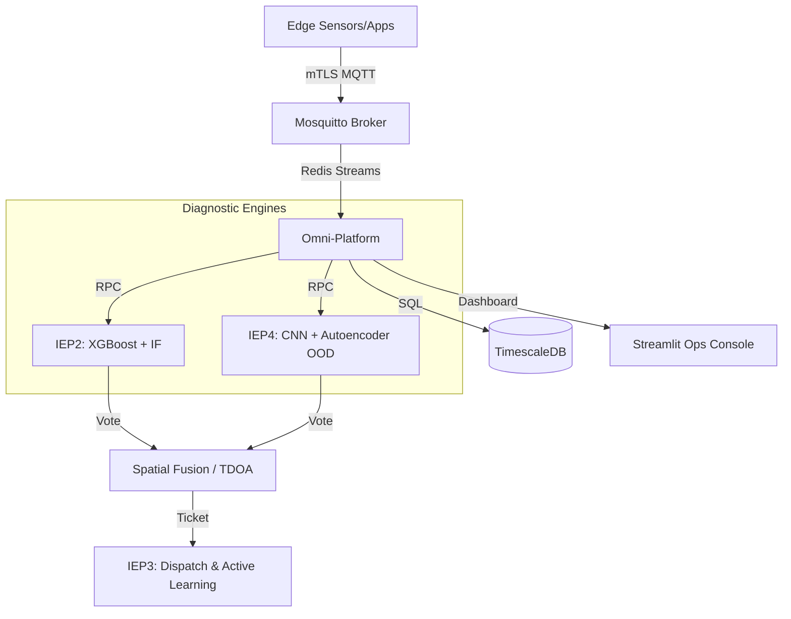

# 🔊 Omni-Sense

> **Hybrid OOD-Aware Acoustic Diagnostics Platform**
> for Urban Infrastructure (Water Leakage & Generator Diagnostics)

[](https://github.com/<org>/omni-sense/actions)
[](LICENSE)

## Overview

Omni-Sense is a **cloud-native, multi-modal** acoustic diagnostic platform designed for high-reliability monitoring of water infrastructure and industrial machinery. It employs a hybrid ensemble of physics-based DSP features and deep learning spectrogram models, protected by advanced Out-of-Distribution (OOD) detection.

## Architecture v2.0

The platform has transitioned from a simple microservices model to a **durable, stream-aligned architecture** capable of handling edge ingestion via secure MQTT and providing high-integrity diagnostics.



### Core Components

1.  **EEP (API Gateway)**: High-performance entry point for HTTP-based diagnostics. Performs internal DSP feature extraction.
2.  **IEP2 (Classic Engine)**: Uses XGBoost and Isolation Forests on structured DSP features (Kurtosis, Wavelet, Spectral Centroid).
3.  **IEP4 (Deep Engine)**: End-to-end 2D-CNN spectrogram classifier with a **CNN Autoencoder** for reconstruction-based OOD detection (Taiwan Water Corp design, 99.07% accuracy).
4.  **Omni-Platform**: The central nervous system. Handles Redis Streams, TimescaleDB persistence, and hosts the Streamlit-based **Operations Console**.
5.  **Spatial Fusion**: Implements **TDOA (Time Difference of Arrival)** for multi-sensor localization of leaks.
6.  **IEP3 (Dispatch)**: Manages maintenance tickets and closes the loop for active learning and model retraining.

## Key Features

-   **Epistemic Safety**: Two-stage OOD detection (Isolation Forest + CNN Autoencoder) ensures the system flags "I don't know" rather than providing false positives in unfamiliar environments.
-   **Durable Messaging**: Powered by **Redis Streams** for at-least-once delivery guarantees.
-   **Industrial Security**: Full **mTLS** encryption for MQTT ingestion from field edge agents.
-   **Spatial Intelligence**: Multi-sensor fusion using TDOA to pin-point leak coordinates.
-   **Observability**: Integrated Prometheus/Grafana stack with custom ML drift and confidence monitors.

## Quick Start

### Prerequisites
- Docker & Docker Compose
- Python 3.11+
- [Optional] OpenSSL (for generating mTLS certs)

### 1. Setup Security
```bash
./omni/scripts/gen_certs.sh
```

### 2. Launch Stack
```bash
docker-compose up --build
```

### 3. Access Dashboards
- **Ops Console (Streamlit)**: http://localhost:8501
- **Grafana**: http://localhost:3000 (admin/admin)
- **Prometheus**: http://localhost:9090
- **API Gateway**: http://localhost:8000

## Engineering Tradeoffs

| Feature | Choice | Justification |
|---|---|---|
| **Durable Bus** | Redis Streams | Better reliability than Pub/Sub; simpler than Kafka for mid-scale. |
| **OOD Method** | CNN Reconstruction | Superior sensitivity to novel acoustic signatures vs. density methods. |
| **Database** | TimescaleDB | Combines relational metadata with high-performance time-series telemetry. |
| **Fusion** | TDOA + Voting | Increases confidence and provides spatial context for field crews. |

## Course

**EECE503N / EECE798N** — AI Engineering Capstone, American University of Beirut

## License

MIT

## Environment Variables

For production-oriented deployment, the system uses environment variables to connect the **EEP** service to internal microservices.

Current configuration (cloud deployment):

```env
OMNI_IEP1_URL=http://34.67.139.17  # External IP for EEP
OMNI_IEP2_URL=http://136.112.232.124  # External IP for IEP2
OMNI_IEP4_URL=http://34.44.48.68  # External IP for IEP4
```
