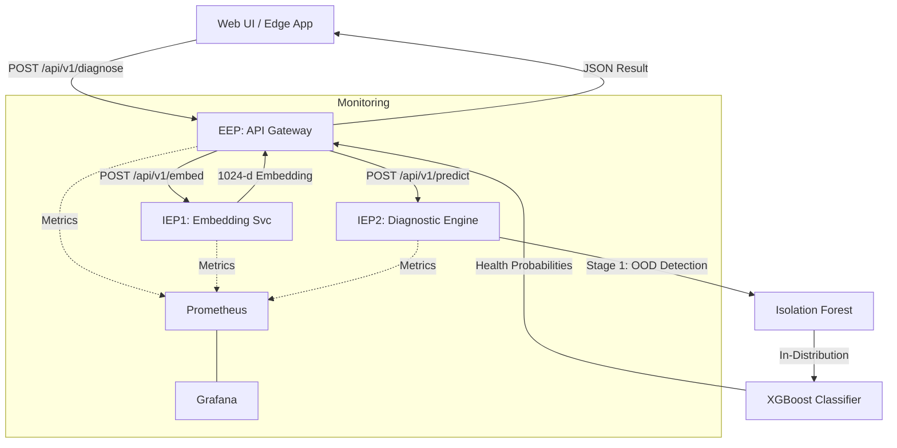

# 🔊 Omni-Sense: Workspace Overview

Omni-Sense is an **Out-of-Distribution (OOD) Aware Acoustic Diagnostics Platform** designed for urban infrastructure monitoring, specifically targeting water leakage and diesel generator health. It uses a microservices architecture to process audio signals through a multi-stage ML pipeline.

## 🏗️ System Architecture

The project follows a modular microservices approach coordinated via Docker Compose.

## 📦 Core Components

### 1. External Endpoint (EEP) - `eep/`
- **Tech Stack**: FastAPI, Uvicorn, HTTPX (for async service calls), Prometheus Client.
- **Function**: API Gateway. It receives raw audio, performs consistency checks/resampling, and orchestrates the diagnostic pipeline.
- **Endpoints**:
  - `POST /api/v1/diagnose`: Main entry point (accepts `.wav` + metadata).
  - `GET /health`: Health checks.
  - `/metrics`: Prometheus metrics.

### 2. Internal Endpoint 1 (IEP1) - `iep1/`
- **Tech Stack**: FastAPI, TensorFlow, TensorFlow Hub (YAMNet), Librosa.
- **Function**: Feature extraction. It uses the pre-trained **YAMNet** model to convert audio into 1024-dimensional embeddings.
- **Endpoints**:
  - `POST /api/v1/embed`: Takes audio, returns embedding vector.

### 3. Internal Endpoint 2 (IEP2) - `iep2/`
- **Tech Stack**: FastAPI, ONNX Runtime, NumPy, Pydantic.
- **Function**: AI Diagnostics. It uses a two-stage approach:
  - **Stage 1 (OOD)**: Uses an **Isolation Forest** model to detect if the input sound is "familiar" to the training data.
  - **Stage 2 (Classification)**: Uses **XGBoost** to classify the state (e.g., `Normal`, `Leak`, `Anomalous`) if Stage 1 passes.
- **Endpoints**:
  - `POST /api/v1/predict`: Takes embeddings, returns OOD status + classification results.

### 4. Web UI - `web-ui/`
- **Tech Stack**: Vanilla HTML/JS/CSS (optimized for smartphone browser access).
- **Function**: A demo interface for recording/uploading audio and viewing real-time diagnostic results with gauge charts and status indicators.

### 5. Monitoring - `monitoring/`
- **Prometheus**: Scrapes metrics from `eep`, `iep1`, and `iep2`.
- **Grafana**: Visualizes system health and ML-specific drift/OOD signals. Default credentials: `admin/admin`.

## 🛠️ Development & Tooling

- **Dependency Management**: Centralized [pyproject.toml](file:///c:/Users/hafez/Desktop/AUB%20Courses/AI%20In%20Industry/omni-sense/pyproject.toml) in root with optional dependency groups ([ml](file:///c:/Users/hafez/Desktop/AUB%20Courses/AI%20In%20Industry/omni-sense/pyproject.toml), `eep`, `iep1`, `iep2`, `dev`).
- **Scripts**: Located in `scripts/` for data synthesis (augmenting audio), model training, and ONNX conversion.
- **Containerization**: Each service has a dedicated [Dockerfile](file:///c:/Users/hafez/Desktop/AUB%20Courses/AI%20In%20Industry/omni-sense/eep/Dockerfile). Local development is run via [docker-compose.yml](file:///c:/Users/hafez/Desktop/AUB%20Courses/AI%20In%20Industry/omni-sense/docker-compose.yml).
- **Testing**: Unified test suite in `tests/` and service-specific tests in `{service}/tests/`.

## 🚀 Current State
The project is structured as a complete E2E pipeline. The ML models are exported to ONNX for efficient inference in `iep2`. The EEP acts as a robust gateway with rate-limiting and validation.
